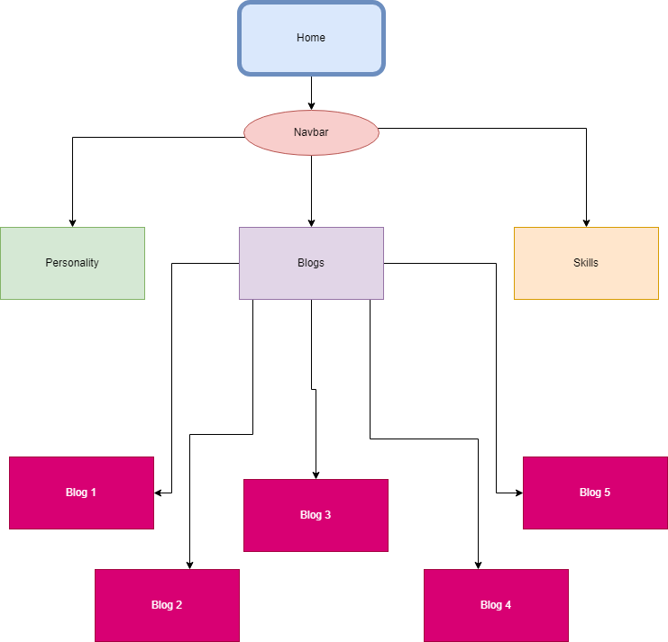

# Portfolio-Website - Kevin Phuong

## Links And Clip

- [Netlify Link](https://kevinphuong.netlify.app/)

- [Github Repository](https://github.com/k3vinphuong/T1A2-Portfolio-Website)

- [Presentation Link](https://youtu.be/usKUCkQF5TQ)

---

## Purpose

Introducing my portfolio and showcasing my ability to create a website using my knowledge of everything I have learnt. Topics that will be present in this portfolio include:

- Being able to create a README.md file
- Creating a sitemap to show the different pages and their layout on both a desktop and mobile view
- Making a video explaining the different features on our portfolio
- Showcasing our knowledge through the use of HTML and CSS to decorate and make our website

---

## Functionality/features

To allow the webpage to function properly and seaminglessly to provide the best possible user experience

---

## Sitemap

The sitemap provided above shows that the main home page will be the hub for everything else and other pages will be accessible from the home page through the nav bar. From the navbar, the personality, blogs and skills page can be accessed. The blog page which can be accessed from the navbar contains all the blogs from blog 1 through to blog 5.

---

## Wireframes

Wireframes for both desktop and mobile view were created through the use of Figma. These wireframes show the difference between each view and allowed us as creators to have a better visualisation on what our actual webpage should look like.

### Page Explanation: Homepage

The hompage is the most simplistic design having a header, main body with a title and a footer. The heading includes a navbar which leads to all the pages and the other pages can be accessed through this navbar. The Main body includes an image as the background and a title which includes the page developers name and a simple introduction. The footer is compiled of 3 icons for aesthetic purposes which will later be expanded in the contacts page, these include a Linkedin icon, a Github icon and en envelope icon for emails.

*Desktop View:*

*Mobile View:*

### Page Explanation: Personality

This page is similar to the homepage in that it includes the same navbar in the header and the same footer. The difference which this page is there is text that is included in the main body. The same technique of having an image in the background is evident. The use of coloured boxes helps to better emphasis the text that is included on the page with their individual titles.

*Desktop View:*

*Mobile View:*

### Page Explanation: SKills/Experience

This page is the same as the personality page with all its properties with the only difference being the text that is provided on the screen.

*Desktop View:*

*Mobile View:*

### Page Explanation: Blogs

This page is the most different page with a very different layout compared to the others. The same navbar in the header is still applied and the same footer however the main difference is in the body. The blogs are showed in a polaroid photo format with an image followed by the title and explanation in a white background shown only on the desktop view.

*Desktop View:*

*Mobile View:*

### Page Explanation: Contact

This page has similar layouts to the other pages in that there is the same navbar in the heading. The body differs in that there is a singular image and not an image in the background. This image is then followed by 3 links which expand on the 3 icons that are in the other pages footer. The footer for the contact page is different to the other pages in that it has my name and year instead of the the three icons.

*Desktop View:*

*Mobile View:*

## Target Audience

The target audience for this website will be for any company wishing to employ a juniopr developer and trying to find something that allows them to see their skills in this tech field. Other target audience can include small businesses who want an example of what they would want when creating a website or when upgrading a preexisting website.

---

## Tech Stack

- HTML
- CSS
- Netlify
- Github
- Figma

---

## Screenshots

### Homepage

*Desktop View:*

*Mobile View:*

### Personality page

*Desktop View:*

*Mobile View:*

### Skills page

*Desktop View:*

*Mobile View:*

### Blogs page

*Desktop View:*

*Mobile View:*

### Contact page

*Desktop View:*

*Mobile View:*

---
